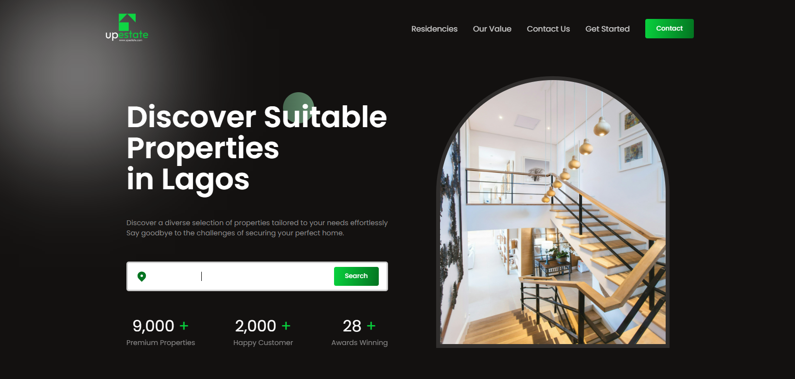

### Real Estate Website - Frontend

This repository contains the frontend code for a real estate website. The website is built using modern web technologies and provides an interactive and user-friendly interface for users to explore and search for properties.

### 🌟 Features
- Property listing with detailed information and images
- Search functionality to find properties based on various criteria
- Interactive property map with location markers
- Property comparison feature
- User-friendly and responsive design
- Smooth animations and transitions

### 🛠 Built With
The frontend of the real estate website is built using the following technologies:
- React: A popular JavaScript library for building user interfaces
- Vite: A fast and lightweight build tool for modern web applications
- Framer Motion: A library for creating smooth animations and transitions
- React Accessible Accordion: A library for creating accessible accordion components
- React CountUp: A library for creating animated number counters
- React Icons: A library that provides a collection of popular icon packs as React components
- React Outside Click Handler: A library for handling clicks outside of a specified component
- Swiper: A library for creating touch-enabled sliders and carousels

### 🚀 Getting Started
To get a local copy of the project up and running, follow these steps:
### Prerequisites
In order to run this project, you need to have the following installed on your machine:

- Node.js npm (Node Package Manager)

### Installation

- Clone the repository:
shCopy codegit clone https://github.com/mekuseo/realestate-Frontend.git

- Navigate to the project directory:
shCopy codecd realestate

- Install the dependencies:
shCopy codenpm install

### Usage
To run the project, execute the following command:
- shCopy codenpm run dev
This will start the development server, and you can view the website in your browser at http://localhost:3000.
- Run Tests
To run tests, use the following command:
shCopy codenpm run test
- Deployment
To create a production build of the website, run the following command:
shCopy codenpm run build
This will generate an optimized and minified version of the project in the dist folder, which can be deployed to a web server.
### 📂 Folder Structure
The project follows a standard folder structure:

- src/: Contains the main source code files
- components/: Contains reusable React components
- pages/: Contains individual pages of the website
- assets/: Contains static assets such as images and icons
- styles/: Contains CSS stylesheets
- App.jsx: The main component that serves as the entry point of the application
- index.js: The entry point of the application

### 🤝 Contributing
Contributions are welcome! If you find any issues or have suggestions for improvements, please open an issue or submit a pull request. Make sure to follow the existing code style and conventions.
### 📜 License
This project is licensed under the MIT License.
### 📧 Contact
If you have any questions or inquiries, please contact the project maintainer at mekuseo@gmail.com.

### 🙏 Acknowledgments
- Vite - Fast and lightweight build tool for modern web applications
- React - JavaScript library for building user interfaces
- Framer Motion - Library for creating smooth animations and transitions
- React Accessible Accordion - Library for creating accessible accordion components
- React CountUp - Library for creating animated number counters
- React Icons - Collection of popular icon packs as React components
- React Outside Click Handler - Library for handling clicks outside of a specified component
- Swiper - Library for creating touch-enabled sliders and carousels